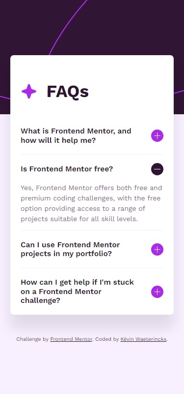
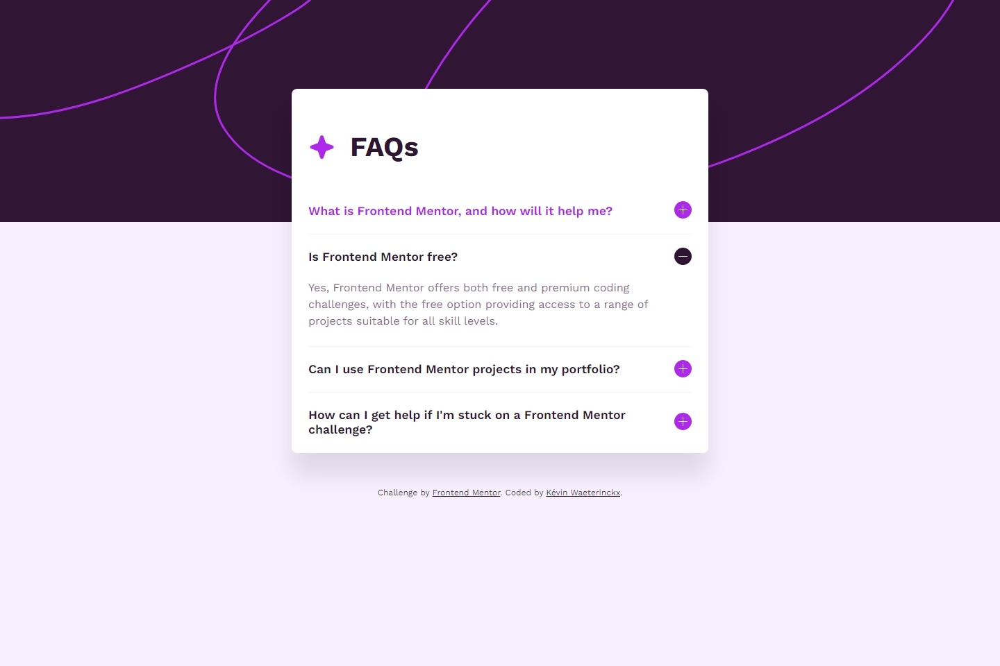

# Frontend Mentor - FAQ accordion solution

This is a solution to the [FAQ accordion challenge on Frontend Mentor](https://www.frontendmentor.io/challenges/faq-accordion-wyfFdeBwBz). Frontend Mentor challenges help you improve your coding skills by building realistic projects. 

## Table of contents

- [Overview](#overview)
  - [The challenge](#the-challenge)
  - [Screenshot](#screenshot)
  - [Links](#links)
- [My process](#my-process)
  - [Built with](#built-with)
  - [What I learned](#what-i-learned)
  - [Continued development](#continued-development)
- [Author](#author)

## Overview

### The challenge

Users should be able to:

- Hide/Show the answer to a question when the question is clicked
- Navigate the questions and hide/show answers using keyboard navigation alone
- View the optimal layout for the interface depending on their device's screen size
- See hover and focus states for all interactive elements on the page

### Screenshot

### Links

- Solution URL: [Solution on GitHub](https://github.com/kwaeterinckx/FrontendMentorChallenge-FaqAccordion)
- Live Site URL: [Live version on Netlify](https://stupendous-babka-0b0f45.netlify.app/)

## My process

### Built with

- Semantic HTML5 markup
- CSS custom properties
- Mobile-first workflow
- JavaScript

### What I learned

The CSS part was not difficult. The JavaScript part was more challenging.
My first script worked good, but I had some issues with the height calculation.
I used JS to set the height of the answers to be able to animate them smoothly.
The transistion property doesn't work with heights set to 0 or auto. I tried with max-height. But the transitions where not what I expected.
So I used JS. Worked well, but I forgot an important setting when doing calculations on the elements of my page; it has to be fully loaded...
But this was solved once I put the exact same code in a 'load' event listener.  
I learned a lot while searching through pages of code on the internet to find a solution. Straight forward, but I'm learning 😊.

I had a lot of fun with this challenge, and learned a lot on my journey.

There is one small initiative that I took; I didn't use the **+** and **-** images.  
I made them using a span so I could animate the transistion from **+** to **-**. Check it out !

### Continued development

The JavaScript part was the best part. Even if it is a few lines of code, it was challenging. I'll keep using JS in further projects and dive deeper into it.

## Author

Kévin Waeterinckx

- Frontend Mentor - [@kwaeterinckx](https://www.frontendmentor.io/profile/kwaeterinckx)
- GitHub - [kwaeterinckx](https://github.com/kwaeterinckx)
- LinkedIn - [Kévin Waeterinckx](https://www.linkedin.com/in/kévin-waeterinckx-58256518a)